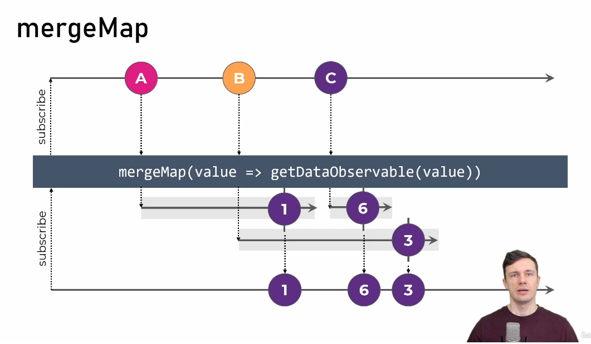
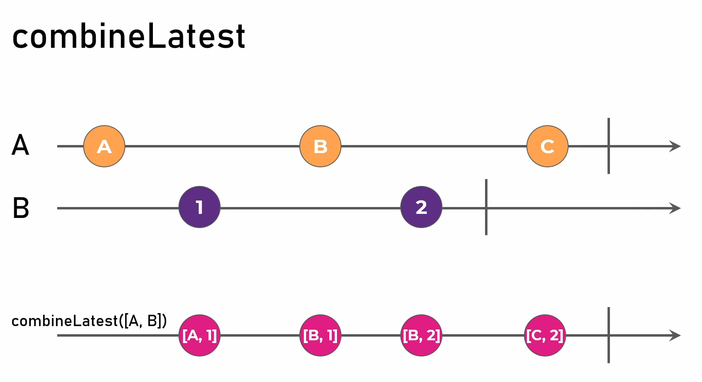

# RxJs

## Observables

### What is Observable?

Technically, an Observable is a wrappped `Promise` with much more functionality then `then` could do.

Didnt get this? No worries, keep reading.

Consider it as a ball(sphere) or standalone node in a graph(tree) which is waiting to be triggered. Doesn't make sense, no problem. Consider an employee instructed to do step by step work but with no command and data to start. Consider a machine, which works step by step as programmed waiting for someone to toggle the switch. Consider Observable as a trigger point.

There are two things in Observable:

1. Now when you write an Observable, you attach manipulations to the data received using `pipes()`
2. When data is manipulated we use `subscribe()` to do operation on manipulated data.

Pipes is optional because you may or may not want to manipulate the data.


```js
import { Observable } from 'rxjs';

const observable$ = new Observable<string>(subscriber => {
    console.log('Observable executed');

    subscriber.next('Alice');
    subscriber.next('Ben');
    setTimeouot(() => {
        subscriber.next('Charlie');
        subscriber.complete();
    }, 2000);

    setTimeout(() => subscriber.error(new Error('Failure')), 4000);

    return () => {
        console.log('Teardown');
    }
});

console.log('Before subscribe');
observable$.subscribe({
    next: value => console.log(value),
    complete: () => console.warn('Completed')
    error: (err) => console.error('Value');
});
console.log('After subscribe');
```

## Types of Observable

1. **Cold Observable** - starts only when subscribed. Each subscription will have separate subscription for each subscriber.
2. **Hot Observable**  - All Subscriptions share the same source.

When the data is produced by the Observable itself, we call it a cold Observable. When the data is produced outside the Observable, we call it a hot Observable.

## Creator Functions

## Pipeable Operators

Operator creates a new observable after adding modifications to the source observable but does not change old observable.

### Filter
```js
of('Happy World')
  .pipe(
    filter((e) => e == 'Happy World'),
    tap((e) => console.log(e))
  )
  .subscribe((e) => console.log('in subcribe: ', e));

of('Happy World')
  .pipe(
    filter((e) => e != 'Happy World'),
    tap((e) => console.log(e))
  )
  .subscribe((e) => console.log('in subcribe: ', e));

// No Streamed value, so tap wont work, just like above example
EMPTY.pipe(
  tap(() => console.warn('Empty i will reach here and complete'))
).subscribe();

// Tap will work as null is a value and not an empty observable
of(null)
  .pipe(tap(() => console.warn('NULL: i will reach here and complete')))
  .subscribe();


// Empty object is a valid value
of({})
  .pipe(tap(() => console.warn('i will reach here and complete')))
  .subscribe();
```

Another proper example of filter
```js
import { Observable } from "rxjs";
import { filter } from "rxjs/operators";


interface NewsItem {
  category: 'Business' | 'Sports';
  content: string;
}

const newsFeed$ = new Observable<NewsItem>(subscriber => {
  setTimeout(() => 
    subscriber.next({ category: 'Business', content: 'A' }), 1000);
  setTimeout(() => 
    subscriber.next({ category: 'Sports', content: 'B' }), 3000);
  setTimeout(() => 
    subscriber.next({ category: 'Business', content: 'C' }), 4000);
  setTimeout(() => 
    subscriber.next({ category: 'Sports', content: 'D' }), 6000);
  setTimeout(() => 
    subscriber.next({ category: 'Business', content: 'E' }), 7000);
});

const sportsNewsFeed$ = newsFeed$.pipe(
  filter(item => item.category === 'Sports')
);

newsFeed$.subscribe(
  item => console.log(item)
);
```

```js
const arr = from([1, 2, 3])
  .pipe(
    tap((e) => console.log(e)),
    filter((e) => e == 1),
    tap((e) => console.log('after filter: ', e))
  )
  .subscribe((e) => console.log('in subscribe: ', e));
```

### debounceTime

Diagram explains well. See the timeline properly.

```js
const ajax1$ = ajax
  .get('https://6285e99396bccbf32d6aba4f.mockapi.io/api/v1/users1')
  .pipe(
    map((e) => e['response']),
    catchError((e) => {
      // console.log('Error: ', e);
      e['message'] = 'Error Occurred';
      return of(e); // Fallback Observable
    })
  );
ajax1$.subscribe((e) => console.log('In ajax1 subscribe: ', e));

const ajax2$ = ajax
  .get('https://6285e99396bccbf32d6aba4f.mockapi.io/api/v1/users1')
  .pipe(
    map((e) => e['response']),
    catchError((e) => {
      // console.log('Error: ', e);
      e['message'] = 'Error Occurred';
      return EMPTY; // Pass an empty Observable, so that there is no Error shown in the observable
    })
  );

ajax2$.subscribe((e) => console.log('In ajax2 subscribe: ', e));
```

## Flattening Operators

Flattening operators subscribe to returned inner observable.

### concatMap

It subscribes to inner observable on first emitted value of the outer observable until inner observable completes.

```js
import { Observable, of } from "rxjs";
import { concatMap } from "rxjs/operators";

const source$ = new Observable(subscriber => {
  setTimeout(() => subscriber.next('A'), 2000);
  setTimeout(() => subscriber.next('B'), 5000);
});

console.log('App has started');
source$.pipe(
  concatMap(value => of(1, 2))
).subscribe(value => console.log(value));
```


Here, the value from the source(outer observable) is delayed by 2000ms.

```js
const source = of(2000, 1000);
const mergeMapExample = source.pipe(
  // just so we can log this a   ter the first example has run
  delay(5000),
  concatMap((val) => of(`Delayed by: ${val}ms`).pipe(delay(val)))
);
//.subscribe((val) => console.log(`With mergeMap: ${val}`));
```

[Another Example of ConcatMap click, ajax call](https://stackblitz.com/edit/rxjs-jw-course-6i3-flattening-dynamic-final?file=index.ts)

### switchMap

It cancels the previous subscription of the inner observable when outer observable emits a new value.


### mergeMap




Notes:

1. Remember, make sure that inner observable closes at some point or else it might cause memory leaks.
2. Remember, inner observable only passes next and error notifications and not complete.
3. If inner observable emits an error, then the outer observable will also stop with an error as well.

### exhaustMap


### forkJoin


`forkJoin` subscription only works when all observables completes.

```js
import { forkJoin } from "rxjs";
// Mike is from New Delhi and likes to eat pasta.

import { ajax } from "rxjs/ajax";

const randomName$ = ajax('https://random-data-api.com/api/name/random_name');

const randomNation$ = ajax('https://random-data-api.com/api/nation/random_nation');

const randomFood$ = ajax('https://random-data-api.com/api/food/random_food');

// randomName$.subscribe(ajaxResponse => console.log(ajaxResponse.response.first_name));
// randomNation$.subscribe(ajaxResponse => console.log(ajaxResponse.response.capital));
// randomFood$.subscribe(ajaxResponse => console.log(ajaxResponse.response.dish));

forkJoin([randomName$, randomNation$, randomFood$]).subscribe(
  ([nameAjax, nationAjax, foodAjax]) => console.log(`${nameAjax.response.first_name} is from ${nationAjax.response.capital} and likes to eat ${foodAjax.response.dish}.`)
);
```

Remember, as soon as error occurs in one of the observable. Teardown function is called by `forkJoin` to all the inner observables.
Notice the output.
```js
import { forkJoin, Observable } from "rxjs";

const a$ = new Observable(subscriber => {
  setTimeout(() => {
    subscriber.next('A');
    subscriber.complete();
  }, 5000);

  return () => {
    console.log('A teardown');
  };
});

const b$ = new Observable(subscriber => {
  setTimeout(() => {
    subscriber.error('Failure!');
  }, 3000);
  
  return () => {
    console.log('B teardown');
  };
});

forkJoin([a$, b$]).subscribe({
  next: value => console.log(value),
  error: err => console.log('Error:', err)
});
```

### combineLatest



Subscription will have latest values emitted by observables.


### Subject

What is a Subject? An RxJS Subject is a special type of Observable that allows values to be multicasted to many Observers. While plain Observables are unicast (each subscribed Observer owns an independent execution of the Observable), Subjects are multicast.

*A Subject is like an Observable, but can multicast to many Observers. Subjects are like EventEmitters: they maintain a registry of many listeners.*

**Subject** behaves as **Observable** as well as **Observer**

```js
import { fromEvent, Subject } from "rxjs";
import { map } from "rxjs/operators";

const emitButton = document.querySelector('button#emit');
const inputElement: HTMLInputElement = document.querySelector('#value-input');
const subscribeButton = document.querySelector('button#subscribe');

const value$ = new Subject<string>();

fromEvent(emitButton, 'click').pipe(
  map(() => inputElement.value)
).subscribe(value$);

fromEvent(subscribeButton, 'click').subscribe(
  () => {
    console.log('New Subscription');
    value$.subscribe(value => console.log(value));
  }
);
```


#### When to use Subject.asObservable()
The purpose of this is to prevent leaking the "observer side" of the Subject out of an API. Basically to prevent a leaky abstraction when you don't want people to be able to "next" into the resulting observable.

Problem with plain `Subject`:
1. If subscribed after emission. Newer Subscription wont receive any value(notification).
2. No default value to subscribers.
3. No latest value to subscribers.

### BehaviorSubject


1. BehaviourSubject has default value which passes to all subscribers even not emitted any value.
2. Passes the latest value or default value on subscription.
3. You can get the latestvalue from a behavioursubject as a variable by using `behavior$.value`/ `behavior$.getValue()`. This also applies to `Subject`.


### withLatestFrom

If you have a `BehaviorSubject` and want latest value into another subscription of an observable, then

```js
fromEvent(printStateButton, 'click').pipe(
  withLatestFrom(isLoggedIn$) // Take latest value from this observable 
).subscribe(
  ([event, isLoggedIn]) => console.log('User is logged in:', isLoggedIn) // and pass it to subscribe parameters.
);
```
It will create an array of values passed to callack, instead of single value.
Remember, it will only work for **BehaviorSubject**
### ReplaySubject

### AsyncSubject

### VoidSubject